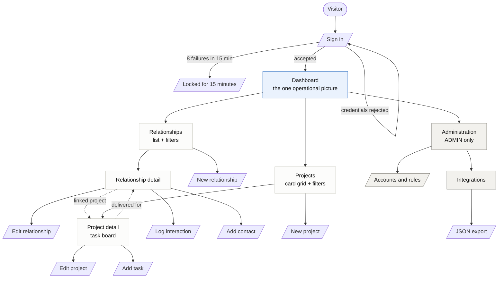
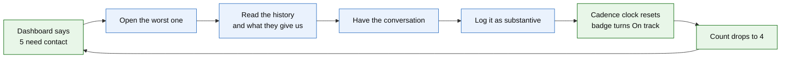
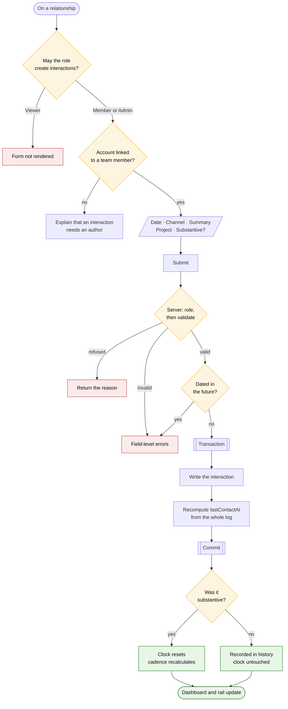
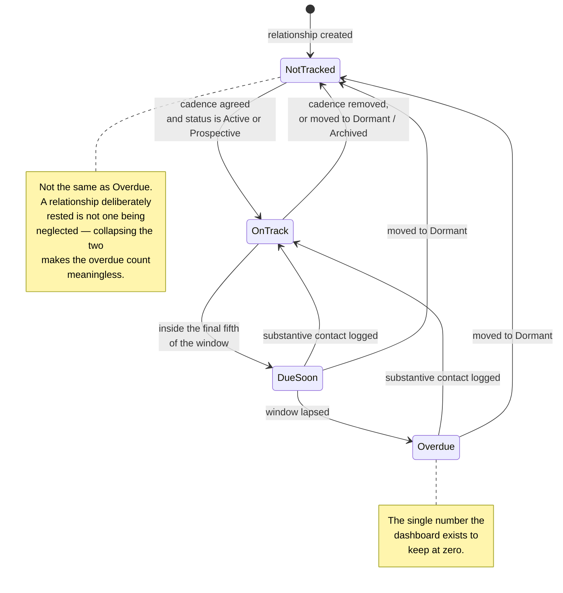
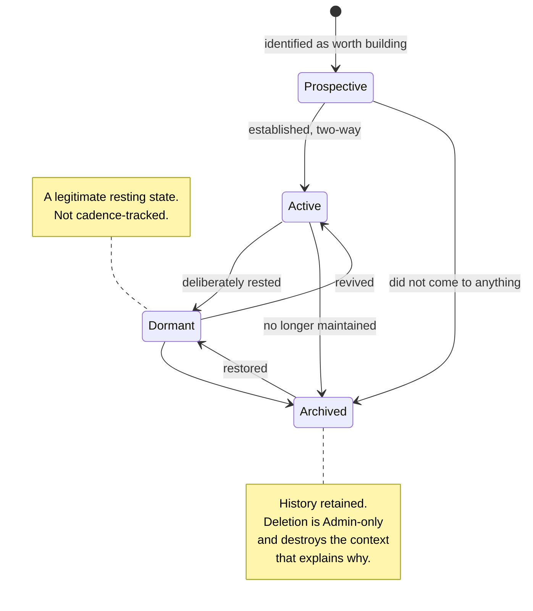
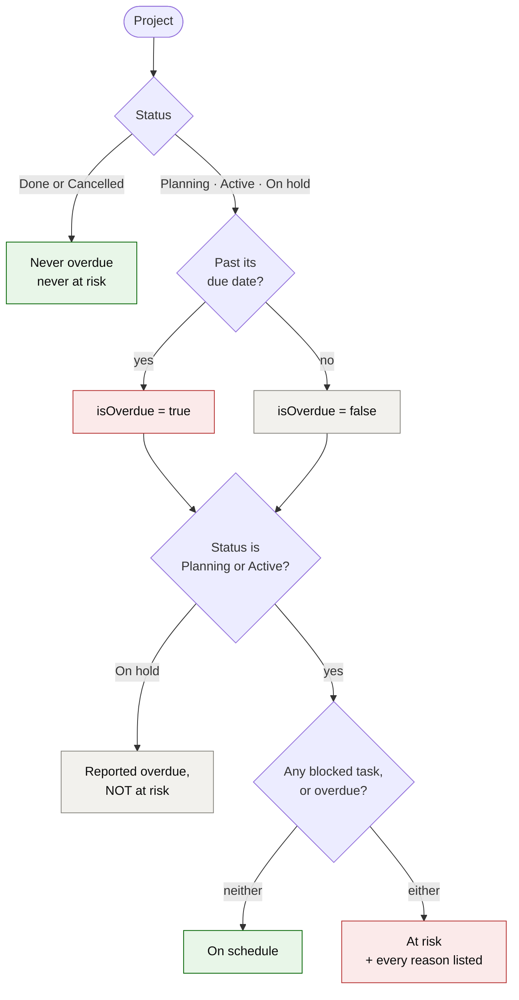
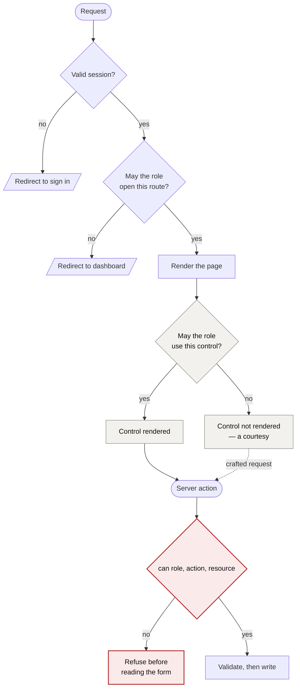
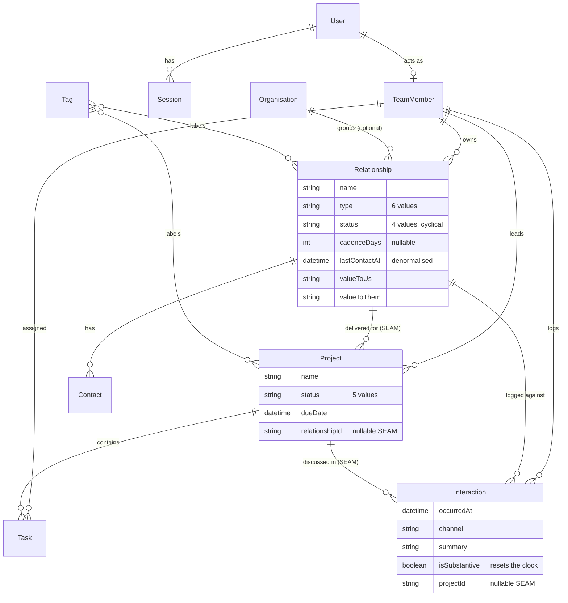

# MVP Flows

**The Viemo Studio Operations Dashboard** · Project UG-S2-28

The flows the MVP is built around, as diagrams. Every one is Mermaid, so GitHub
renders it inline and the source stays reviewable in a pull request — a picture
that lives in a design file drifts from the product the week after it is drawn.

**For the design workstream:** §9 maps each diagram to what to build in Figma
and what to leave here.

---

## 1. Information architecture

Every screen in the product, and how someone reaches it.

**The dotted lines are the point.** They are the two seams between the modules —
the only places the BRM and PM halves meet, and the only reason the dashboard
can show one picture rather than two.

---

## 2. The core loop

The reason the product exists. Everything else supports this cycle.

Blue is the person; green is the system. **The system's job is the first and
last step — telling someone what needs them, and confirming it is handled.**
A tool that only stored records would have neither.

---

## 3. Logging an interaction

The most frequent action in the product, and the one carrying the decision the
whole cadence feature rests on.

**Two things this diagram exists to make visible.**

The permission is checked **twice** — once to decide whether to render the form,
and again on the server before the input is read. Only the second is a boundary;
the first is a courtesy.

`lastContactAt` is **recomputed from the whole log**, not compared against the
new date. A naive "only move forward" is wrong three ways, all covered in
`tests/integration/record-interaction.test.ts` — see
[ADR-0002](adr/0002-derive-values-rather-than-store-them.md).

---

## 4. Cadence, as a state machine

The BRM module's health signal. Derived on every read, never stored.

The window: `clockStart = lastContactAt ?? createdAt`, `dueAt = clockStart +
cadenceDays`, warning at `clamp(ceil(cadenceDays × 0.2), 1, 30)` days out.

**A relationship never contacted runs its clock from when it was added** —
adding it is what creates the obligation to make first contact, so a new
prospect gets a full first window and still cannot silently disappear.

---

## 5. Relationship lifecycle

A cycle, not a funnel. This is the structural difference from a CRM.

**Nothing in the code treats a later state as better than an earlier one.** A
CRM pipeline advances toward a close and the record then leaves the board; here
a relationship can move around this cycle for years in either direction.

---

## 6. Project risk

Overdue is a fact. At risk is a judgement, and it is narrower.

**A paused project is never flagged at risk, even when overdue.** Pausing it was
a decision the team already took and recorded; reporting it back as a risk asks
them to act on their own choice, and it buries the projects that need attention.

---

## 7. Authorisation

Three layers, of which one is a boundary.

**The dotted line is why the last gate exists.** Someone who can construct a
POST reaches the action whether or not the interface showed them a button. The
red gate is the only one that holds — see
[ADR-0006](adr/0006-authorise-inside-server-actions.md).

---

## 8. Data model

The shared spine. Both modules are built on it and meet at two nullable keys.

**Both seams are nullable on purpose.** A project can be internal; a
conversation need not be about a project. That is what lets either module be
built and demonstrated without the other, and it is what makes five people
working in parallel possible —
[ADR-0003](adr/0003-modules-never-import-each-other.md).

---

## 9. What to build in Figma, and what to leave here

Not everything belongs in a design file. The split:

| Diagram | Figma? | Why |
|---|---|---|
| §1 Information architecture | **Yes** | Designers need the map to place screens against |
| §2 Core loop | **Yes** | The strongest slide in any presentation; worth drawing properly |
| §3 Logging an interaction | **Yes** — as a screen flow | Redraw as wireframes with the form states, not as boxes |
| §4 Cadence state machine | No | Logic, not interface. Link to it from the design file. |
| §5 Relationship lifecycle | **Yes** — simplified | Four states as a loop; it is the product's central argument |
| §6 Project risk | No | Logic. The interface only shows the outcome. |
| §7 Authorisation | No | Backend. Designers need the outcome — which controls each role sees. |
| §8 Data model | No | Engineering. |

### Building §1 and §2 in Figma

1. One frame each, 1920 × 1080, so they double as presentation slides.
2. Nodes: 8px radius, 1px `line` border, `surface` fill. Type at **body** (14px)
   weight 500.
3. Connectors: 1.5px in `ink-muted`. **Seam connectors dashed** — the distinction
   is the content, not decoration.
4. Colour only where it means something: `accent-soft` for entry points,
   `good-soft` for system responses, `critical-soft` for failure paths.
5. Label groups with the **micro** style (11px, mono, uppercase, `ink-muted`),
   matching the eyebrow in the product.

Full token values are in [design-system.md](design-system.md) §2–§4. Keeping the
Figma names identical to the token names is what lets a designer and a developer
point at the same thing and be sure it is the same thing.

### Redrawing §3 as a screen flow

The version above is a decision diagram — useful for engineers, wrong for a
design review. For Figma, draw the four states of the form instead:

`empty → filled → submitting → logged (badge flipped, clock reset)`

with the substantive checkbox called out, because that single control is what
makes the cadence figure worth believing.
